# Overview

**URL For Git Repo Import into Azure Devops:**  
https://github.com/LeeKnight344/D365-FinOps-StarterKit.git

This guide walks users through creating the resources required for digesting data from F&O or Dataverse using the Synapse Link for Dataverse Connector (referred to as SLfD throughout this repo) into a Synapse workspace, and loading that data incrementally into either a Synapse Dedicated SQL Pool or an Azure-hosted/On-Prem SQL Server.

### The resources included in the Bicep Files are as follows:

#### Synapse Link with Azure Hosted/On-Prem Hosted SQL Database:
- Synapse Workspace
- Apache Spark Pool
- Data Lake Storage Account (HCL Enabled Storage)
- Azure SQL Server (General Purpose V5, Standard)
- Azure SQL Database
- Key Vault

#### Synapse Link with Synapse Workspace Dedicated SQL Pool:
- Synapse Workspace
- Apache Spark Pool
- Data Lake Storage Account (HCL Enabled Storage)
- Synapse SQL Pool Resource
- Key Vault

<!-- 
Following are the two common architecture choices to achieve the objective:

1. Use [Synapse link with delta lake format](https://learn.microsoft.com/en-us/power-apps/maker/data-platform/azure-synapse-link-delta-lake) and then use an ETL tool to copy the data to the destination database.
2. Use [Synapse link with incremental update](https://learn.microsoft.com/en-us/power-apps/maker/data-platform/azure-synapse-incremental-updates) and then use an ETL tool to copy the data to the destination database.

Key options and considerations for data integration scenarios:

| Option                          | Description                                                                 | Use Case                                                   | Cost Factors                                           |
|----------------------------------|-----------------------------------------------------------------------------|-------------------------------------------------------------|-------------------------------------------------------|
| Synapse link with delta lake     | Final data in Delta Lake format, Lake database on Synapse workspace, ready to query via Synapse serverless or Spark notebook | Incremental data integration + consuming the data via Synapse Serverless, Spark, Microsoft Fabric, Power BI, Databricks, etc. | Azure storage account, Synapse Spark Pool for delta conversion, data pipeline |
| Synapse link with incremental update | Initial and incremental data in timestamp-based folder in CSV with metadata in CDM | Incremental data integration | Azure storage account + data pipeline to copy the data |
-->

## Branch Triggers

This repository has been developed with 2 primary branches and a release branch, all of which are used for automated pipeline triggers.

- **Development Branch** - Changes to the Development branch trigger deployments to development resources. Trigger filters can be found in the `.yml` files.
- **Main Branch** - Changes to the main branch trigger deployments to UAT resources. Trigger filters can be found in the `.yml` files.
- **Release/* Branches** - New release branches can be created for production environments to deploy changes to production. Pipelines need to be manually run against each release branch as these branches are manually created, not committed into. Examples of release branches can be seen below:

    - Create a new release branch by navigating to `Branches > New branch > Select source as main` and name it using the `release/01, 02, 03` structure:

    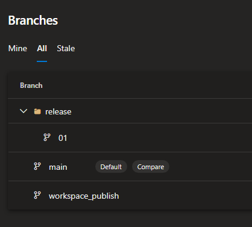

    - Manually run the pipelines for production: navigate to `Pipelines > Select the pipeline you want to run for production > Select the branch as the new release branch`

    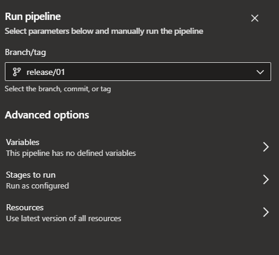

## Prerequisites
1. Create and configure an Azure DevOps organization and project.
2. Create a service connection to your Azure subscription that you'll be deploying resources to. Refer to the [Service Connection Documentation](https://learn.microsoft.com/en-us/azure/devops/pipelines/library/service-endpoints?view=azure-devops).
3. Import this repository into your DevOps Project:

    - Navigate to `Repos > Select the Dropdown > Select Import Repository`

    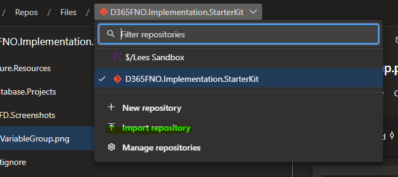

    - Input the provided Git URL and give the repository a new name:

    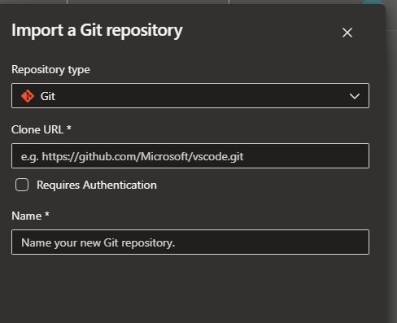

4. Set up the deployment pipelines with the provided `.yml` files. Please choose either the Synapse-hosted or self-hosted database options. Do not use both:

    - **Azure Resources Deployment**:
        - **Azure Hosted Database Deployment**: `Azure.Resources/Azure.Resources.SynapseLink.AzureHostedDB/AZ.SynapseLink-AzureHostedDB-builddeploy-armtask.yml`
        - **Synapse Hosted Database Deployment**: `Azure.Resources/Azure.Resources.SynapseLink.SynapseDedicatedDB/AZ.SynapseLink-SynapseDedicatedDB-builddeploy-armtask.yml`
        - **Synapse Serverless Database Deployment**: `Database.Projects/slfd-serverless-dw.yml`

    - Select `New Pipeline`, then choose `Azure Repos Git`:

        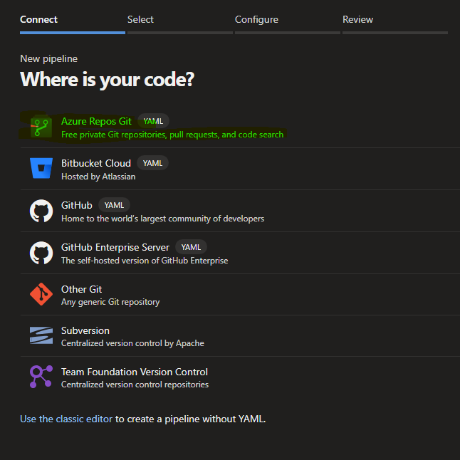

    - Choose the option to use an existing `.yml` file:

        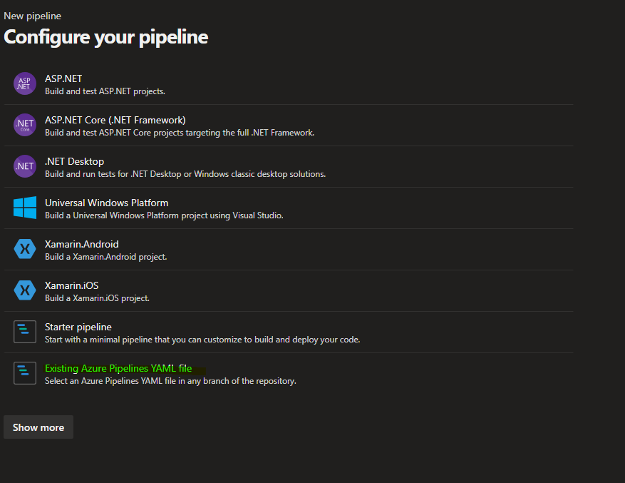

    - Use the newly created repository:

        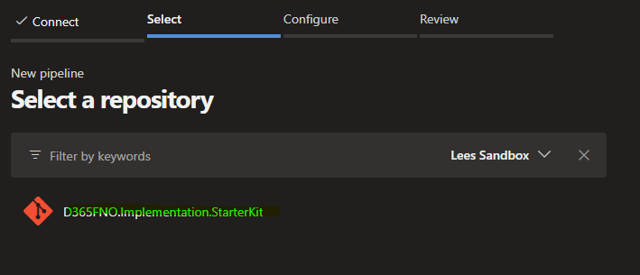

    - Select the path of the `.yml` file:

        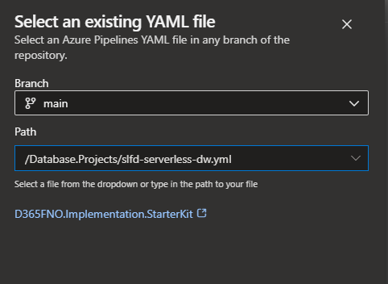

    - Ensure to save and not run:

        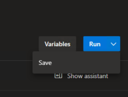

    - Rename the pipeline to make it easier to view from the Pipelines overview board:

        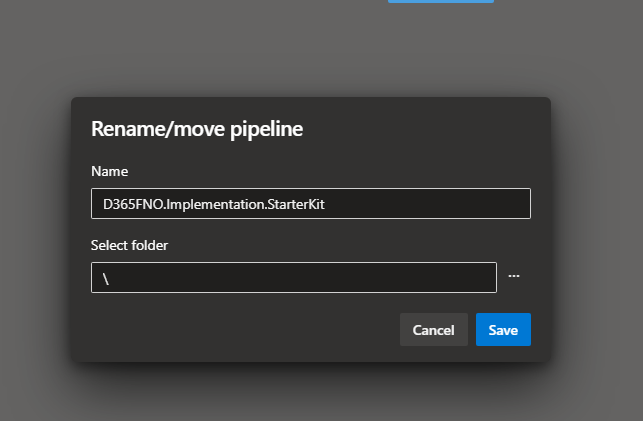

5. Rename the YAML override parameters to ones of your choosing, e.g., in `AZ.SynapseLink-AzureHostedDB-builddeploy-armtask.yml`, change `AZ_SynapseWorkspace_Name` to the desired name.

6. Create variable groups for your Development, UAT, and Production environments:
   - **SLFD - Secure Development Variables**
   - **SLFD - Secure UAT Variables**
   - **SLFD - Secure Production Variables**

    Add required values to these groups, ensuring resource names match those in your YAML templates.

    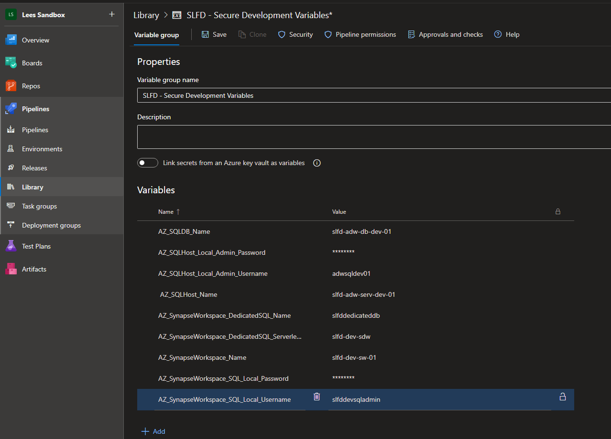

7. Run the Azure Resource deployment pipeline (choose either `AZ.SynapseLink-AzureHostedDB-builddeploy-armtask.yml` or `AZ.SynapseLink-SynapseDedicatedDB-builddeploy-armtask.yml`) to create Azure resources.

    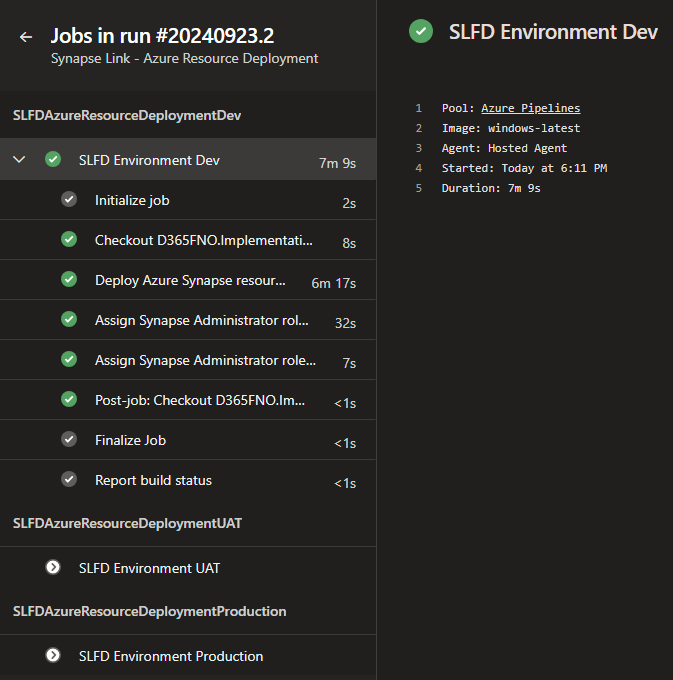

8. Run the Synapse Serverless DB deployment pipeline to ensure the database is created successfully.

    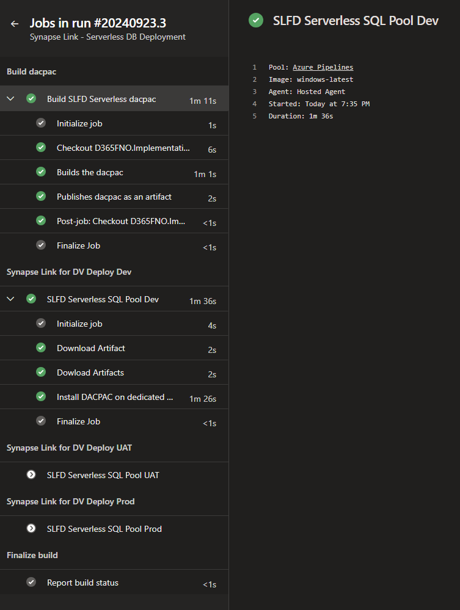

9. Run the Azure DB or Synapse Dedicated DB deployment pipeline to ensure the database is created successfully.

    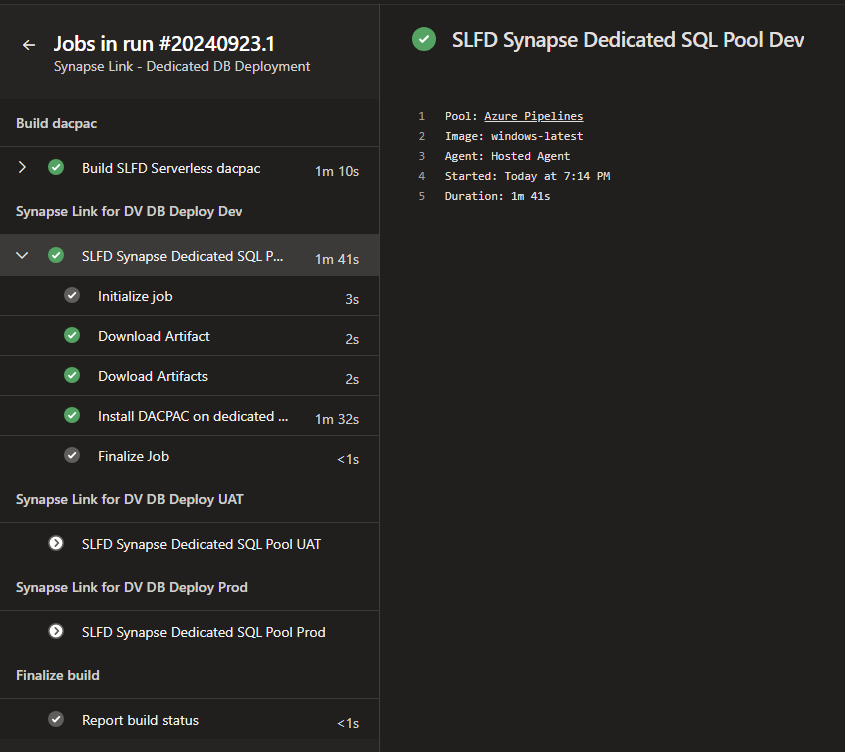

10. Create the Azure Synapse Link profile using the storage account created with the Bicep deployment - [Azure Synapse Link Documentation](https://learn.microsoft.com/en-us/power-apps/maker/data-platform/azure-synapse-link-select-fno-data)

11. When logging into the Synapse Workspace for the first time, you might encounter the following error:

    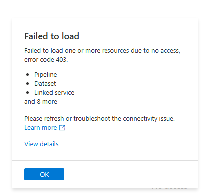

    - To resolve, navigate to `Manage (the blue toolbox) > Access Control > Add`. Select your email and the DevOps service principal, and assign the **Synapse Administrator** role. Wait 2 minutes and refresh the page:

    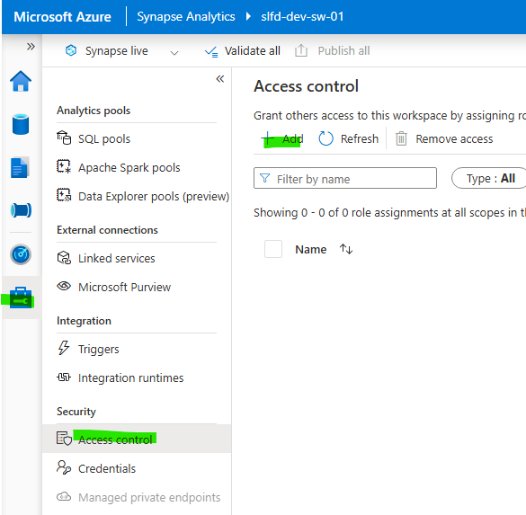  
    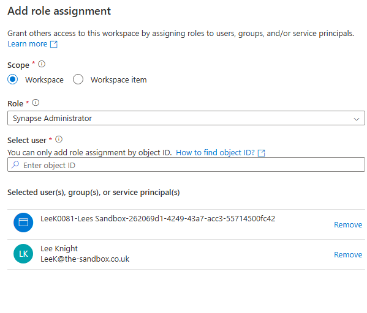

12. Connect your Synapse workspace to Git: `Manage > Git Configuration > Configure`.  
    Select the repository type as Azure DevOps Git, then select your tenant.

    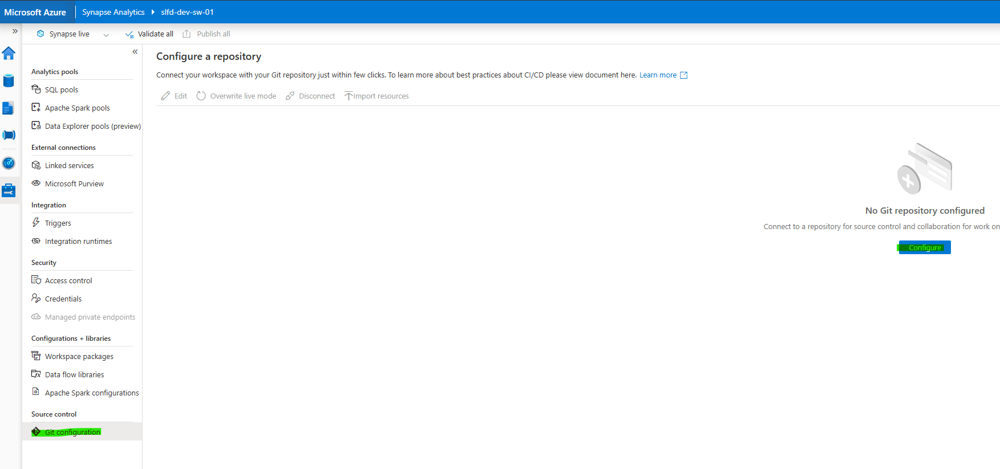

    Select your DevOps Project and repository, set the `main` branch as the collaboration branch, and leave `workspace_publish` as the publish branch. The root folder should be `Azure.Resources/Synapse.Analytics.Resources`.

    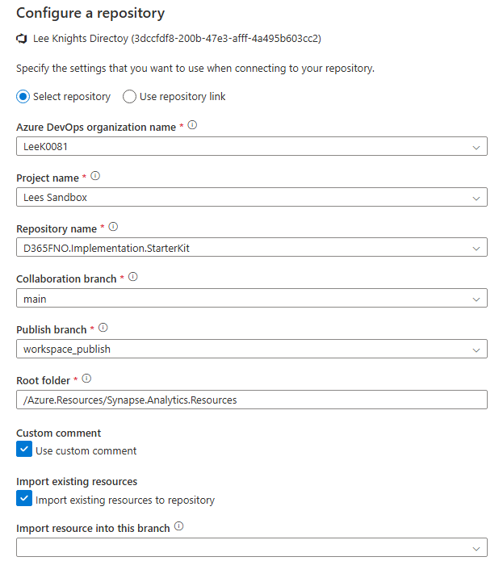

13. Copy the `.yml` template `Azure.Resources/Synapse.Analytics.Resources/slfd-dw-deploy.yml` into the `workspace_publish` branch. Configure override parameters to match your data lake path and export method (Delta or CSV). Generate a deployment pipeline from the copied `.yml` to push workspace changes when published. Note that branch-based triggers are unavailable here—use Environment Approvals to control changes.

    - Refer to: [Azure DevOps Approvals Documentation](https://learn.microsoft.com/en-us/azure/devops/pipelines/process/approvals?view=azure-devops&tabs=check-pass
   
14. Make sure to enter the correct pipeline parameters for your scenario, the details for each parameter can be seen below. These also need to be updated in the YML template for the Synapse - `AZ.SynapseLink-AzureHostedDB-builddeploy-armtask.yml`:

| Parameter name         | Description                                                                                                | Example                                                                                               |
|------------------------|------------------------------------------------------------------------------------------------------------|-------------------------------------------------------------------------------------------------------|
| SourceDbServer          | Source Synapse serverless DB server name                                                                   | d365analyticssynapse-ondemand.sql.azuresynapse.net                                                    |
| SourceDbName            | Source Synapse serverless DB name                                                                          | dataverse_analytics_orgf89b314a                                                                        |
| SourceSchema            | Source schema                                                                                              | dbo                                                                                                   |
| TargetDbServer          | Target SQL/Synapse dedicated pool server name                                                              | d365-sa-lab-analytics.database.windows.net                                                            |
| TargetDbName            | Target Synapse serverless DB name                                                                          | D365Data                                                                                              |
| TargetSchema            | Target schema                                                                                              | dbo                                                                                                   |
| StorageDataLocation     | Data container location in storage account                                                                 | https://d365analyticsincremental.dfs.core.windows.net/dataverse-analytics-orgf89b314a/                 |
| IncrementalCSV          | Is Source Synapse link incremental CSV?                                                                    | Source Synapse link with incremental update CSV then true; Source Synapse link with delta then false   |
| GenerateSourceMetadata  | Generate metadata on the source database when pipeline runs?                                               | Source Synapse link with incremental update CSV then true; Source Synapse link with delta then false   |
| Remove_mserp__prefix    | Removes the `mserp_` prefix from the entity name and fields if virtual entities are being exported.         | true or false                                                                                         |
| translate_enums         | Adds a column for each enum in the table (suffixed with `$label`) with the text value of the enum.          | true or false                                                                                         |
| translate_BYOD_enums    | Changes the enum value from Dataverse to finance and operations enum value for BYOD migrations.             | true or false                                                                                         |

