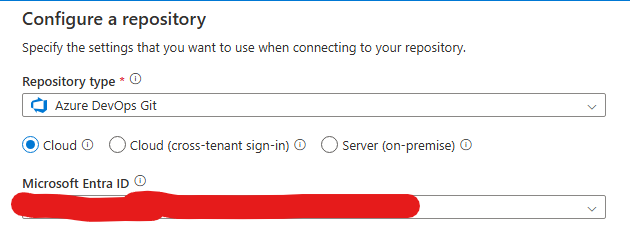
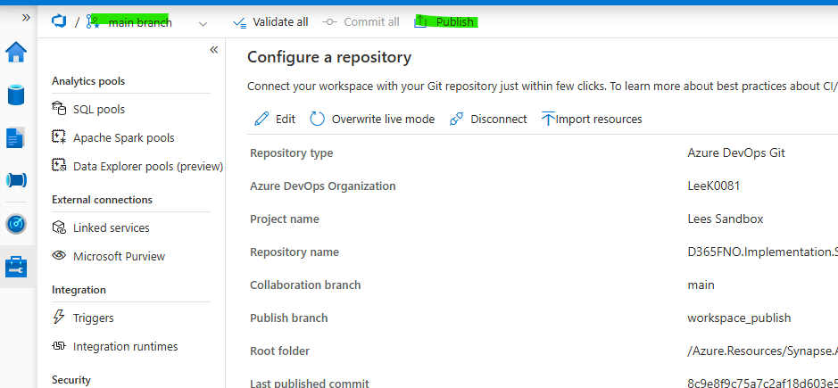
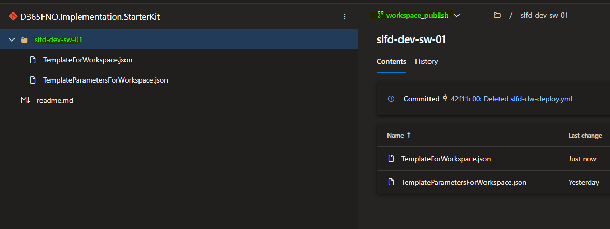

# Overview
This Guide is to walk users through creating the resources required for digesting data from F&O or dataverse from the Synapse Link for Dataverse Connector (referebced to as SLfD throughout this repo) into a Synapse workspace and loading that data incrementaly into either a Synapse Dedicated SQL Pool or an Azure Hosted/On-Prem hosted SQL server.

The resources included in the Bicep Files are as follows:

Synapse Link with Azure Hosted/On-Prem Hosted SQL Database:

- Synapse Workspace
- Apache Spark Pool
- Datalake Storage Account (HCL Enabled Storage)
- Azure SQL Server (General Purpose V5 , Standard)
- Azure SQL Database 
- Key Vault

Synapse Link with Synapse Workspace Dedicated SQL Pool:

- Synapse Workspace
- Apache Spark Pool
- Datalake Storage Account (HCL Enabled Storage)
- Synapse SQL Pool Resource
- Key Vault

<!-- Following are the two common architecture choices to achieve the objective  

1. Use [Synapse link with delta lake format](https://learn.microsoft.com/en-us/power-apps/maker/data-platform/azure-synapse-link-delta-lake) and then use ETL tool to copy the data to destination database
2. Use [Synapse link with incremental update](https://learn.microsoft.com/en-us/power-apps/maker/data-platform/azure-synapse-incremental-updates) and then use ETL tool to copy the data to destination database

Specially for data integration scenarios following are the key options and considerations 

|Options 				|Description	| Use case   											| Cost factors			 
|-------------------------------	|-----------	|---------------										|---------------------
|Synapse link with delta lake		|Final data in Deltalake format, Lake database on Synapse workspace, ready to query via Synapse serverless or Spark notebook| Incremental data integration + consuming the data directly by variety of tools.. synapse serverless, spark notebook, Microsoft Fabric, Power BI, Databricks etc. | Azure storage account, Synapse spark pool for delta conversion + data pipeline to copy the data |										
|Synapse link with incremental update|Initial and incremental data in timestamp based folder in CSV with metadata in CDM | Incremental data integration | Azure storage account + data pipleine to copy the data | -->

## Branch Triggers

**This repository has been developed with 2 primary branches and a release branch, all of which are used for automated pipeline triggers.**

 - Development Branch - Changes to the Development branch trigger deployments to development resources, trigger filters can be found in the .yml files

 - main Branch - Changes to the main branch trigger deployments to UAT resources, trigger filters can be found in the .yml files

 - release/* Branches - New release branches can be created for Production environments to deploy changes to prod. Pipelines will need to be manually run against each release branch as these branches are manually created, not commited into. Examples of release branches can be seen below:

	- Create a new release branch by going to branches > New branch > select source as main and name it with the release/01,02,03 structure:
    
	
	
		

	- With these new release branches you need to manually run the pipelines for production, navigate to pipelines > select the pipeline you want to run for production > select the branch as the new release branch

		
		
		

## Prerequisites
1. Create and configure an Azure Devops Organisation and Project
2. Create a service connection to your Azure subscription that you'll be deploying resources to - [Service Connection Documentation](https://learn.microsoft.com/en-us/azure/devops/pipelines/library/service-endpoints?view=azure-devops)
3. Import this repository into your Devops Project:
	<!-- - Git URL - #TODO -->

	- Navigate to Repos > Select the Dropdown > Select Import Repository  
	

	- Input the provided git URL and give the repository a new name  
	

4. Setup the  deployment Pipelines with the provided YML files. Please only use the datbase option for either synapse or self hosted database, the same goes for the Azure Resource YML
	- Each YML file can be found below:

		- Azure Hosted Databse Azure resources deployment (Chose either Azure Hosted Databse or Synapse Hosted Database not both!): **Azure.Resources/Azure.Resources.SynapseLink.AzureHostedDB/AZ.SynapseLink-AzureHostedDB-builddeploy-armtask.yml**
		- Synapse Hosted Database Azure Resource deployment (Chose either Azure Hosted Databse or Synapse Hosted Database not both!): **Azure.Resources/Azure.Resources.SynapseLink.SynapseDedicatedDB/AZ.SynapseLink-SynapseDedicatedDB-builddeploy-armtask.yml**
		- Synapse Serverless Database Deployment: **Database.Projects/slfd-serverless-dw.yml**
		- Azure Hosted Database Deployment (Chose either Azure Hosted Databse or Synapse Hosted Database not both!):  **Database.Projects/slfd-azhosted-dw.yml**
		- Synapse Hosted Database Deployment (Chose either Azure Hosted Databse or Synapse Hosted Database not both!):  **Database.Projects/slfd-synapsededicated-dw.yml**

		- Select New Pipeline and then select Azure Repos Git:

			

		- Use the option to chose an Existing YML File:

			

		- Use the new Repo you created:

			

		- Select the path of the YML:

			

		- Ensure to save and not run:

			

		- Rename the pipeline to make it easy to view from the Pipelines overview board:

			

5. Rename the YML override parameters to ones of your chosing, for example in **Azure.Resources/Azure.Resources.SynapseLink.AzureHostedDB/AZ.SynapseLink-AzureHostedDB-builddeploy-armtask.yml** you can change **AZ_SynapseWorkspace_Name** to the name you require. If done properly you can will need the value you populated in the variable group.

5. Create variable groups for your Development, UAT and Production environment and name them as the below. Please note if you need to rename these groups then you'll need to change the references to them in the YML pipeline files - https://learn.microsoft.com/en-us/azure/devops/pipelines/library/variable-groups?view=azure-devops&tabs=azure-pipelines-ui%2Cyaml: 
     - SLFD - Secure Development Variables
	 - SLFD - Secure UAT Variables
	 - SLFD - Secure Production Variables

	 
6. Add values to your Variable groups, these values are all used during your deployment pipelines and are needed in order to properly deploy each of your resources. Please make sure you name the resources in the name way in your YML template to prevent mismatched variables. You may also note that some of the below are for Azure Hosted Database and some are for Synapse Dedicated Databases:
	- AZ_SQLDB_Name
	- AZ_SQLHost_Local_Admin_Password
	- AZ_SQLHost_Local_Admin_Username
	- AZ_SQLHost_Name
	- AZ_SynapseWorkspace_DedicatedSQL_Name
	- AZ_SynapseWorkspace_DedicatedSQL_Serverless_DbName
	- AZ_SynapseWorkspace_Name
	- AZ_SynapseWorkspace_SQL_Local_Password
	- AZ_SynapseWorkspace_SQL_Local_Username

		

7. Run the Azure Resource deployment pipeline (Either AZ.SynapseLink-AzureHostedDB-builddeploy-armtask.yml or AZ.SynapseLink-SynapseDedicatedDB-builddeploy-armtask.yml) and enure all Azure resources are created successfully

	  

8. Run the Synapse Serverless DB Deployment Pipeline and ensure the database is created successfully

	
	  

9. Run the Azure DB or Synapse Dedicated DB deployment pipeline and ensure the database is created successfully

	  

10. Create the Azure Synapse Link profile with the storage account created with the Bicep deployment - https://learn.microsoft.com/en-us/power-apps/maker/data-platform/azure-synapse-link-select-fno-data

11. When logging into the Synapse Workspace for the first time you'll likley see the below error:

	

	- To resolve the error navigate to manage (the blue toolbox) > Access Control > Add > select your email and the devops service principal (only searchable by name and not guid, find the name by searching for the guid in Entra ID and copying the display name result) and assigning the Synapse Administrator role. Wait 2 minutes after and then refresh your page:

	 
	

	

12. Now we want to connect our workspace to GIT, to do this navigate to manage > Git Configuration > Configure:

    - Select the repository type as Azure Devops Git and select your tenant

	Select your Devops Project and repository, then select main as the collab branch and leave workspace_pubplish as the publish branch, the root folder must always be Azure.Resources/Synapse.Analytics.Resources unless you change the repo structre as this is where the synapse resources are located

13. Now all of the resources required for the pipelines to work are there, ensure the trigger meets your requirements and select publish towards the top of the page. This will create the workspace_publish branch where the ARM templates will live for the Workspace. 

14. From here you can copy the YML template **Azure.Resources/Synapse.Analytics.Resources/slfd-dw-deploy.yml** into workspace_publish (as this is where synapse changes publish too). Ensure to fill out the override paramters with the ones that match your datalake path and export method (delta or CSV). You can then generate a deployment pipeline from the copied YML to push workspace changes when they are published. **Please note, branch based triggers are not available here, please use Environment Approvals to stop changes going straight to prod - https://learn.microsoft.com/en-us/azure/devops/pipelines/process/approvals?view=azure-devops&tabs=check-pass**

Default parameters listed below against the Synapse pipeline.

|Parameter name		|Description  							    | Example	
|-------------------|------------------------------				|---------------										
|SourceDbServer		|Source synapse serverless db server name	|d365analyticssynapse-ondemand.sql.azuresynapse.net
|SourceDbName		|Source synapse serverless db name		    |dataverse_analytics_orgf89b314a
|SourceSchema		|Source schema								|dbo
|TargetDbServer		|Target SQL/Synapse dedicated pool server name|d365-sa-lab-analytics.database.windows.net
|TargetDbName		|Source synapse serverless db name			|D365Data
|TargetSchema		|target schema								|dbo
|StorageDataLocation|Data container location in storage account     |https://d365analyticsincremental.dfs.core.windows.net/dataverse-analytics-orgf89b314a/
|IncrementalCSV     |Is Source synapse link is incremental CSV ? | Source synapse link with incremental update CSV then true; Source synapse link with delta then false
|GenerateSourceMetadata|Want to generate metadata on the source database when pipeline runs ?|  Source synapse link with incremental update CSV then true; Source synapse link with delta then false (as metadta is already created by)
|Remove_mserp__prefix|If true and virtual entities are being exported, this will remove the mserp_ prefix from the entity name and the fields.|true or false
|translate_enums|If true and using tables, this will add a column for each enum in the table, the column will be suffixed with $label and will have the text value of the enum.| true or false  
|translate_BYOD_enums|If using virtual entities to support BYOD migration this will change the enum value from the Dataverse generated enum value to the finance and operations enum value. For this feature to work you must export the table srsanalysisenums. You cannot have both translate_enums and translate_BYOD_enums as true.| true or false

**Run the pipeline as scheduled trigger** 

## Derived tables
One of the known limitations with Synapse Link is derived tables, this is outlined in [Known limitations with finance and operations tables](https://learn.microsoft.com/en-us/power-apps/maker/data-platform/azure-synapse-link-select-fno-data#known-limitations-with-finance-and-operations-tables)
# D365-FinOps-StarterKit

